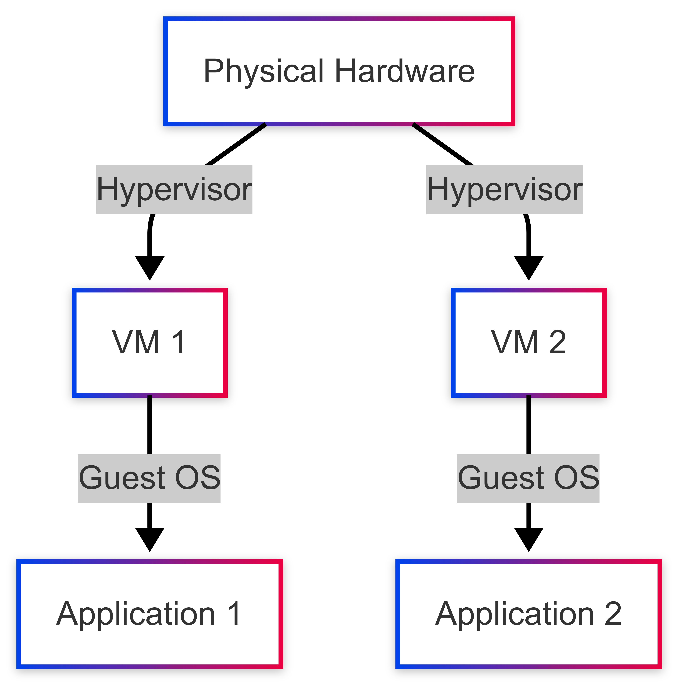
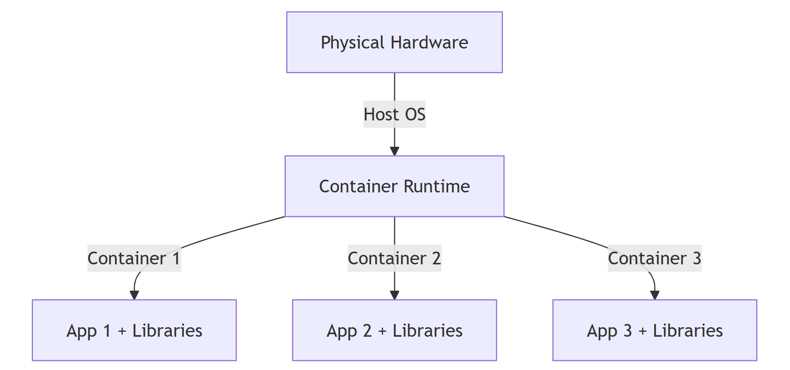
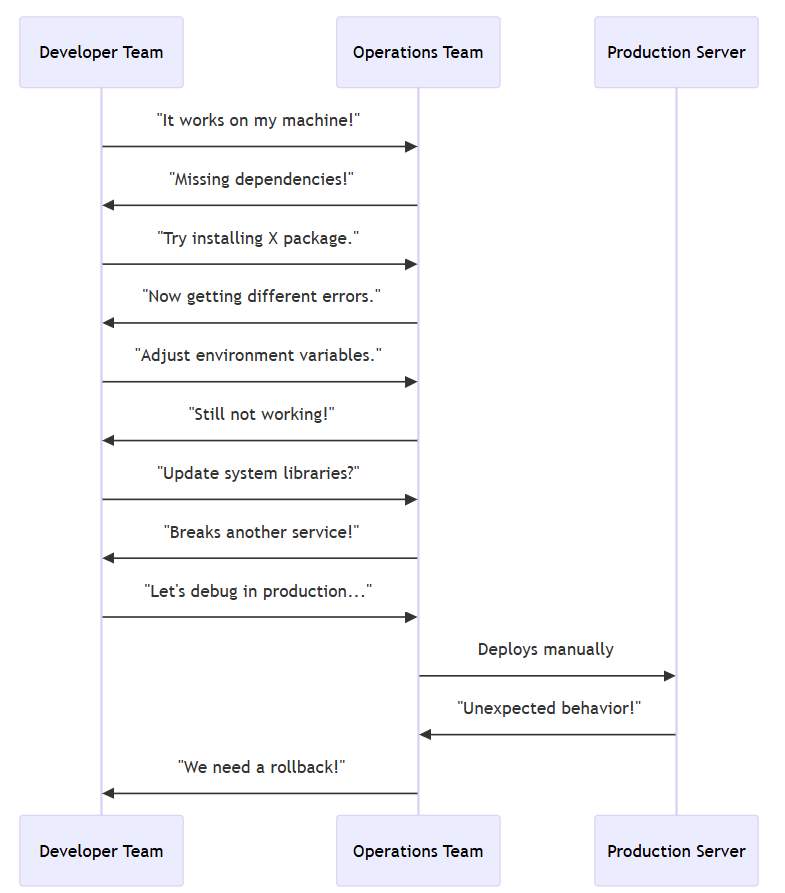
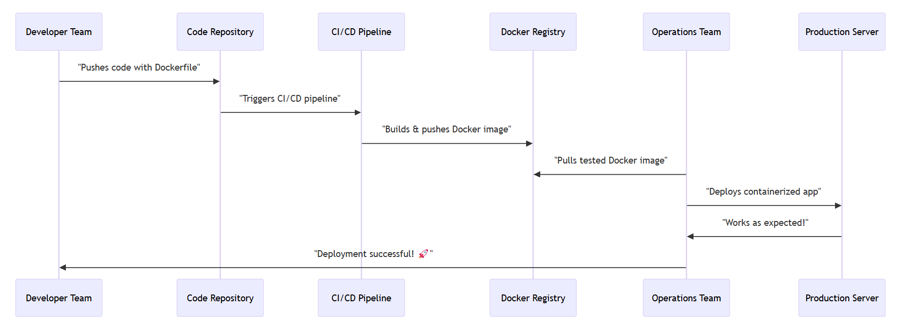

# Docker Up & Running Book Notes

## Introduction to Operating Systems, Virtualization, and Containers

### 1. Understanding Operating Systems
An **Operating System (OS)** is system software that manages hardware and software resources on a computer. It provides an interface between users and hardware. Examples include **Windows, Linux, and macOS**.

At the heart of an OS is the **Kernel**, which manages hardware, processes, memory, and system calls.

---

### 2. Virtual Machines (VMs) and Hypervisors
Before containers became popular, **Virtual Machines (VMs)** were the primary way to run multiple applications on the same physical server.

- A **VM** runs on top of a **Hypervisor**, which abstracts physical hardware and allows multiple OS instances to run independently.
- Each VM has its own **Guest OS**, which makes them resource-heavy but provides strong isolation.

#### Virtual Machine Architecture

This diagram shows how each VM runs its own OS, which leads to overhead.

---

### 3. Containers: Lightweight Virtualization
Unlike VMs, **Containers** share the host OS kernel but run in isolated environments. This makes them:
- **Lightweight** (No need for separate OS per container)
- **Faster** (Lower startup time)
- **More efficient** (Uses fewer resources)

Containers use **namespaces** (for isolation) and **cgroups** (for resource limits) to achieve a level of separation similar to VMs but with much lower overhead.

#### Containerized Architecture

This diagram shows that all containers share the **Host OS Kernel**, making them more efficient.

---

### 4. Virtual Machines vs. Containers
| Feature          | Virtual Machines (VMs) | Containers |
|-----------------|-----------------------|-----------|
| OS Overhead    | Each VM has a full OS  | Share Host OS Kernel |
| Boot Time      | Minutes                | Seconds   |
| Resource Usage | High (full OS per VM)  | Low (Shared OS) |
| Isolation      | Strong                 | Moderate  |
| Portability    | Harder                  | Easy to move between systems |

---

## Benefits of Docker Workflow

- Packaging software in a way that leverages the skills developers already have.
- Bundling application software and required OS filesystems together in a single standardized image format.
- Using packaged artifacts to test and deliver the exact same artifact to all the systems in all environments.
- Abstracting software applications from the hardware without sacrificing resources.

### What Docker isn't?

- Enterprise Virtualization Platform(VMWare, KVM, etc.)
- Cloud Platform
- Configuration Management(Puppet, Chef, etc.)
- Deployment Framework(Capistrano, Fabric, etc.)
- Development environment(Vagrant, etc.)
- Workload Management(Mesos, Kubernetes, Swarm, etc.)

## The Docker Landscape

### Process Simplification

#### Traditional process without Docker

#### Docker Workflow

## Architecture of Docker

### Client/Server model

- Docker consists of three parts: The Client, The Server and The Rgistry(Optional).
- The Server does the work of building, running and managing the containers and the Client is use to instruct the Server what to do.

### Network Ports and Unix Sockets

- Docker command line tool(Client) and Docker daemon(server) can talk to each other over Unix Sockets and Network Ports.
- TCP Port 2375 for unencrypted traffic, Port 2376 for encrypted SSL connections, Port 2377 for Docker Swarm mode.
- By default, Unix Socket for communication with local Docker daemon is used.

### Robust Tooling

